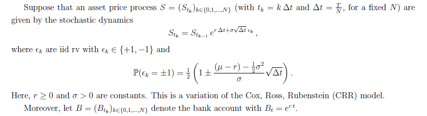

# Valuation of American Options - A Discrete Approximation
## Project Overview
This project focuses on the valuation of American put options using a discrete-time approximation of a continuous-time asset price evolution. The project evaluates the exercise boundary, hedging strategies, profit and loss distributions, and exercise time distributions under varying volatility and risk-free rate assumptions.

We employed Monte Carlo simulations to approximate real-life continuous-time stock price dynamics by discretizing time and analyzing the behavior of American options. The asset price follows a variation of the Cox-Ross-Rubenstein (CRR) model, and the results offer insight into how market variables impact the decision to exercise an option early.

## Abstract
We study the valuation, exercise boundary, hedging strategies, profit and loss distributions, and exercise time distributions of American put options under different risk-free rate and volatility assumptions by approximating real-life continuous-time stock price evolution by discretizing continuous time into small time steps and performing Monte Carlo simulations. We found that increasing the risk-free rate pushes up the exercise boundary and results in a wider distribution of profit and loss, an earlier exercise time, and a higher probability of early exercise. Increasing the volatility pushes down the exercise boundary and results in a higher profit and a higher probability of early exercise. If the realized volatility is higher than assumed volatility, the profit and loss is higher, the exercise time is higher, and the probability of exercise is higher.

More details can be found in project.pdf

## How to Run
The project can be run using the provided Jupyter Notebook (ipynb), which includes the full implementation of the simulations, plots, and analysis.